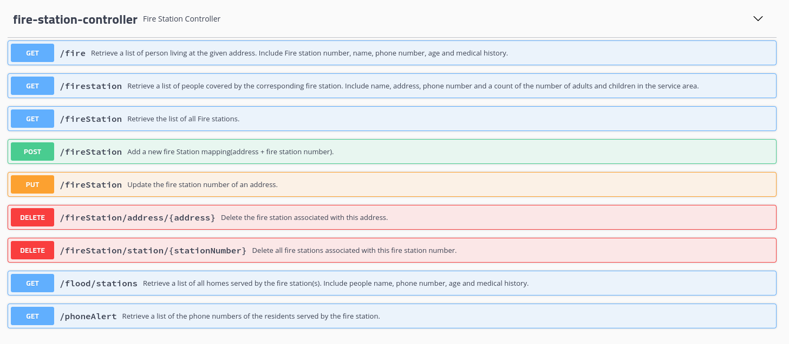
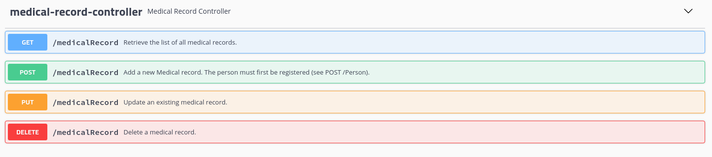
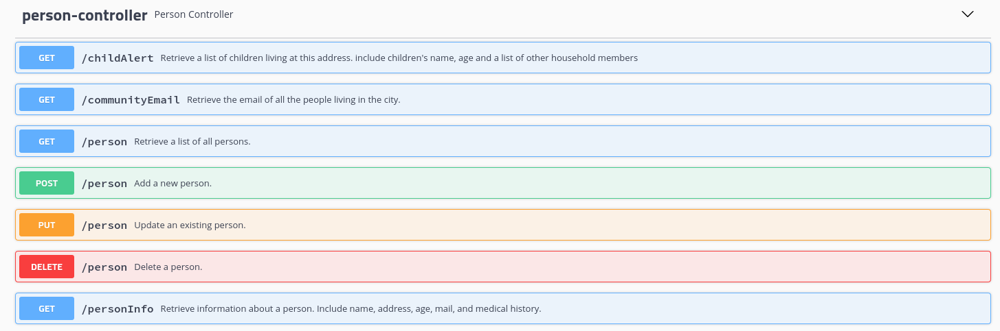

<h1>SafetyNetAlerts</h1>

The purpose of this application is to send information to emergency service systems.
The application will provide information on the people present at the scene of an incident.


<h2>Why ?</h2>

   - A fire breaks out  ! 

Provide information on the people present in the building. 

   - A hurricane is approaching !

Alert the people of the region by text message.

   - A flood occurs !

Provide emergency services with information on people in the area (age, medical history, etc.) 


<h2>How ?</h2>

It's a back-end Rest Api built with Spring Boot.<br/>
The application imports information about people (Name, first name, address, phone number, age, medication, allergies, email) from a Json file.

When the program start, the application serializes data from a json file and filled temporary an H2 database.
Endpoints allowing access to this information are now available.

The application respond to GET requests in JSON format <br/>
POST/UPDATE/DELETE requests are also available 


<h2>Built with </h2>

- java 11 <br/> https://www.oracle.com/java/technologies/javase-jdk11-downloads.html
- Maven 3.6.3  <br/> http://maven.apache.org/
- Spring Web (Build web,uses Apache Tomcat as the default embedded container) <br/> https://mvnrepository.com/artifact/org.springframework/spring-web
- JUnit (execution of Unit Tests) <br/> https://mvnrepository.com/artifact/org.junit.jupiter/junit-jupiter-api
- JaCoCo (test coverage reports) <br/> https://mvnrepository.com/artifact/org.jacoco/jacoco-maven-plugin
- Lombok (Java annotation library which helps to reduce boilerplate code) <br/> https://mvnrepository.com/artifact/org.projectlombok/lombok
- H2 database (non-persistent, fast and light database) <br/> https://h2database.com/html/main.html
- Jackson(JSON library) <br/> https://mvnrepository.com/artifact/com.fasterxml.jackson.core/jackson-databind
- Swagger (Api documentation) <br/> https://swagger.io/

<h2>Installation and Getting Started</h2>
<h3>Requirements</h3>

 - Java 11
 - Maven 3.6.3

<h3>Installation</h3>

1. Clone this repo 
   ```shell
   git clone https://github.com/G-jonathan/SafetyNetAlerts.git

2. Package the application
   ```shell
   mvn package
   
3. Execute the Jar
   ```shell
   java -jar ./target/SafetyNetAlerts-0.0.1-SNAPSHOT.jar

<h3>EndPoints</h3>
All available endpoints as well as the documentation to use them can be viewed at the following address when the program is running.

http://localhost:8080/swagger-ui.html#/



